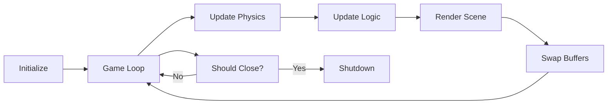

<div align="center">

# 🎮 Kaya Game Engine

### *A high-performance 3D game engine built from the ground up*

[](LICENSE)
[](https://isocpp.org/)
[](https://www.opengl.org/)
[](https://cmake.org/)

**Modern C++17** • **OpenGL 4.6 Core** • **Jolt Physics** • **Cross-Platform**

[Features](#-features) • [Getting Started](#-getting-started) • [Documentation](#-documentation) • [Examples](#-examples)

---

</div>

## 📖 About

Kaya is a modern, from-scratch 3D game engine designed for learning and experimentation. Built with clean architecture and modern C++17, it provides a solid foundation for game development with integrated physics simulation, real-time rendering, and an intuitive API.

## ✨ Features

### 🎨 Rendering System
- **Modern OpenGL 4.6** - Core profile with programmable pipeline
- **PBR Rendering** - Physically Based Rendering with metallic-roughness workflow
- **Dynamic Lighting** - Advanced lighting with Cook-Torrance BRDF
- **Shadow Mapping** - Real-time directional light shadows with PCF filtering
- **Post-Processing** - Bloom, tone mapping, and vignette effects
- **Skybox System** - Cubemap loading and environment mapping
- **Texture System** - PNG/JPG/TGA loading with filtering and wrapping modes
- **Model Loading** - Import OBJ, GLTF, and FBX models with Assimp
- **Flexible Camera** - First-person perspective camera with smooth controls
- **Shader System** - Easy-to-use shader compilation and uniform management
- **Primitive Rendering** - Optimized cube and sphere geometry with normals and UVs

### ⚡ Physics Engine
- **Jolt Physics Integration** - Industry-grade physics simulation
- **Rigid Body Dynamics** - Full support for dynamic and static bodies
- **Collision Detection** - Automatic broad-phase and narrow-phase collision
- **Shape Support** - Box and sphere collision shapes with more coming
- **Layer-Based Filtering** - Efficient collision layer management

### 🎯 Core Systems
- **Application Framework** - Clean game loop with lifecycle hooks
- **Window Management** - Cross-platform windowing via GLFW
- **Input Handling** - Keyboard and mouse input with easy polling API
- **Event System** - Ready for extension with custom events
- **Math Library** - Full GLM integration for vector/matrix operations

### 🛠️ Developer Experience
- **CMake Build System** - Modern, cross-platform build configuration
- **Clean Architecture** - Well-organized, modular codebase
- **Header-Only Includes** - Simple single-header API (`#include <Kaya.h>`)
- **Example Projects** - Learn from working sandbox applications

## 🚀 Getting Started

### Prerequisites

- **CMake** 3.20 or higher ([Download](https://cmake.org/download/))
- **C++17 Compiler** (MSVC 2019+, GCC 9+, or Clang 10+)
- **Git** for dependency management

### Quick Setup

**1. Clone the repository**
```bash
git clone https://github.com/AngeloAliCapuzzoHojaji/KayaGameEngine.git
cd KayaGameEngine
```

**2. Install dependencies**
```bash
# Clone GLFW
git clone https://github.com/glfw/glfw.git ThirdParty/glfw

# Clone GLM
git clone https://github.com/g-truc/glm.git ThirdParty/glm

# Clone Jolt Physics
git clone https://github.com/jrouwe/JoltPhysics.git ThirdParty/JoltPhysics

# Clone Dear ImGui
git clone https://github.com/ocornut/imgui.git ThirdParty/imgui

# Clone ImGuizmo
git clone https://github.com/CedricGuillemet/ImGuizmo.git ThirdParty/ImGuizmo
```

**3. Generate GLAD**
- Visit https://glad.dav1d.de/
- **Language**: C/C++
- **API gl**: Version 4.6
- **Profile**: Core
- Click **GENERATE** and extract to `ThirdParty/glad/`

**4. Build the engine**
```bash
# Windows
mkdir build && cd build
cmake ..
cmake --build . --config Release

# Linux/macOS
mkdir build && cd build
cmake -DCMAKE_BUILD_TYPE=Release ..
make -j$(nproc)
```

**5. Run an example**
```bash
# Windows - Run the comprehensive Rendering Demo
.\bin\Release\RenderingDemo.exe

# Or run other examples
.\bin\Release\Sandbox.exe
.\bin\Release\KayaEditor.exe
.\bin\Release\FPSExample.exe

# Linux/macOS
./bin/RenderingDemo
./bin/Sandbox
```

**🎨 Rendering Demo**: See [Examples/RENDERING_DEMO.md](Examples/RENDERING_DEMO.md) for full controls and features showcase.

> 💡 **Detailed setup instructions**: See [SETUP.md](SETUP.md) for platform-specific guidance and troubleshooting.

## 🎮 Sandbox Demo

The included sandbox demonstrates core engine features:

### Controls
| Key | Action |
|-----|--------|
| `W` `A` `S` `D` | Move camera forward/left/back/right |
| `Space` | Move camera up |
| `Left Shift` | Move camera down |
| `Left Mouse` | Shoot a physics-enabled box |
| `ESC` | Close application |

### What's Included
- 🌍 **Ground Plane** - Static collision surface
- 📦 **Dynamic Boxes** - Falling and stackable rigid bodies
- ⚪ **Physics Spheres** - Rolling sphere simulation
- 🎯 **Interactive Spawning** - Click to shoot objects
- 🎥 **Free Camera** - Fly around the scene

## 📚 Examples

### Creating Your First Game

```cpp
#include <Kaya.h>

class MyGame : public Kaya::Application {
public:
    MyGame() : Application("My Awesome Game") {}

    void OnInit() override {
        // Initialize camera
        m_Camera = std::make_unique<Kaya::Camera>(45.0f, GetWindow().GetAspectRatio());
        m_Camera->SetPosition(glm::vec3(0, 2, 10));

        // Initialize physics
        m_Physics = std::make_unique<Kaya::PhysicsSystem>();
        m_Physics->Initialize();
        
        // Create a ground
        m_Ground = m_Physics->CreateBox(glm::vec3(0, -1, 0), glm::vec3(10, 1, 10), false);
        
        // Create a dynamic box
        m_Box = m_Physics->CreateBox(glm::vec3(0, 5, 0), glm::vec3(1, 1, 1), true);
    }

    void OnUpdate(float deltaTime) override {
        m_Physics->Update(deltaTime);
        
        // Handle input
        if (Kaya::Input::IsKeyPressed(Kaya::KeyCode::Space)) {
            // Apply upward force
            m_Physics->AddForce(m_Box, glm::vec3(0, 100, 0));
        }
    }

    void OnRender() override {
        Kaya::Renderer::BeginScene(*m_Camera);
        
        // Render ground
        auto groundPos = m_Physics->GetBodyPosition(m_Ground);
        Kaya::Renderer::DrawCube(groundPos, glm::vec3(10, 1, 10), glm::vec4(0.3, 0.5, 0.3, 1));
        
        // Render box
        auto boxPos = m_Physics->GetBodyPosition(m_Box);
        Kaya::Renderer::DrawCube(boxPos, glm::vec3(1, 1, 1), glm::vec4(0.8, 0.3, 0.2, 1));
        
        Kaya::Renderer::EndScene();
    }

    void OnShutdown() override {
        m_Physics->Shutdown();
    }

private:
    std::unique_ptr<Kaya::Camera> m_Camera;
    std::unique_ptr<Kaya::PhysicsSystem> m_Physics;
    JPH::BodyID m_Ground, m_Box;
};

// Entry point
Kaya::Application* Kaya::CreateApplication() {
    return new MyGame();
}
```

### More Examples

Check out the [Examples](Examples/) directory for:
- 🎨 Custom shaders and materials
- 🎯 Advanced physics simulations
- 🎮 Input handling patterns
- 📦 Scene management

## 🏗️ Architecture

### Engine Structure

```
KayaGameEngine/
├── Source/              # Engine source code
│   ├── Core/           # Application, window, entry point
│   ├── Rendering/      # Renderer, shaders, camera
│   ├── Physics/        # Jolt Physics integration
│   ├── Input/          # Keyboard and mouse input
│   └── Kaya.h         # Single header include
├── Examples/           # Sample applications
│   └── Sandbox.cpp    # Interactive physics demo
├── ThirdParty/        # External dependencies
│   ├── glfw/          # Window management
│   ├── glad/          # OpenGL loader
│   ├── glm/           # Math library
│   └── JoltPhysics/   # Physics engine
└── CMakeLists.txt     # Build configuration
```

### Design Principles

- ✅ **Modular Design** - Clear separation of concerns
- ✅ **Clean API** - Intuitive and easy to use
- ✅ **Performance** - Optimized for real-time applications
- ✅ **Extensibility** - Easy to add new features
- ✅ **Cross-Platform** - Windows, Linux, macOS support

### Application Flow



## 🗺️ Roadmap

### Current Version (v1.0)
- ✅ Core engine architecture
- ✅ OpenGL 4.6 rendering
- ✅ Jolt Physics integration
- ✅ Basic primitives (cubes, spheres)
- ✅ Camera system
- ✅ Input handling

### Version 1.1 - Editor Release
- ✅ **Visual Editor** - Full-featured scene editor with ImGui
- ✅ Entity system with component-based architecture
- ✅ Scene hierarchy panel with selection
- ✅ Properties inspector for editing transforms, rendering, and physics
- ✅ Viewport window with framebuffer rendering
- ✅ Transform gizmos (translate, rotate, scale)
- ✅ Menu bar with file operations
- ✅ Real-time scene preview

### Planned Features

#### 🎨 Rendering
- [x] Texture system with loading and sampling
- [x] Model loading (GLTF, OBJ, FBX)
- [x] Shadow mapping with directional lights
- [x] PBR (Physically Based Rendering) with metallic-roughness workflow
- [ ] Post-processing effects (bloom, tone mapping, color grading)
- [ ] Particle systems
- [ ] Skybox and environment mapping with HDR support

#### ⚙️ Core Systems
- [x] Entity Component System (basic)
- [x] Scene graph and hierarchy
- [ ] Asset management system
- [ ] Serialization and save/load
- [ ] Resource hot-reloading
- [ ] Profiler and debugging tools

#### 🎮 Gameplay
- [ ] Audio system (OpenAL integration)
- [ ] Animation system
- [ ] UI/GUI framework
- [ ] Scripting support (Lua/Python)
- [ ] AI and pathfinding
- [ ] Networking for multiplayer

#### 🛠️ Tools
- [x] **Visual editor** - Scene hierarchy, properties inspector, viewport, transform gizmos
- [ ] Material editor
- [ ] Advanced scene editor features (copy/paste, prefabs)
- [ ] Asset pipeline tools

## � Examples

Kaya includes several example projects to help you get started:

### 🎨 RenderingDemo
**Comprehensive showcase of all rendering features**

Interactive demo with three scenes demonstrating:
- Texture system and UV mapping
- PBR materials (metallic-roughness workflow)
- Shadow mapping with PCF filtering
- Post-processing (bloom, tone mapping, vignette)
- Skybox rendering

**Controls:**
- WASD/Space/Shift: Camera movement
- Mouse: Look around
- 1-4: Toggle features/switch scenes
- ESC: Exit

📖 Full guide: [Examples/RENDERING_DEMO.md](Examples/RENDERING_DEMO.md)

### 🎯 Sandbox
Minimal example showing basic application setup and rendering.

### 🎮 FPSExample
First-person camera example with physics integration.

### 🛠️ KayaEditor
Visual editor with scene hierarchy, properties panel, and 3D viewport.

## �🎨 Using the Editor

The Kaya Editor provides a complete visual environment for scene creation and editing.

### Running the Editor

```bash
# Windows
.\build\bin\Release\KayaEditor.exe

# Linux/macOS
./build/bin/KayaEditor
```

### Editor Features

- **Scene Hierarchy** - View and manage all entities in your scene
  - Right-click to create new entities (Cube, Sphere, Empty)
  - Click to select entities
  - Right-click on entities to delete
  
- **Properties Inspector** - Edit entity properties in real-time
  - Transform: Position, Rotation, Scale
  - Render: Geometry type, Color, Visibility
  - Physics: Body info, Dynamic/Static, Mass
  
- **Viewport** - Real-time 3D scene preview
  - WASD: Move camera forward/left/back/right
  - Space/Shift: Move camera up/down
  - Right Mouse + Drag: Rotate camera
  - Gizmo controls: Translate, Rotate, Scale
  - Ctrl: Snap to grid
  
- **Menu Bar**
  - File: New Scene, Open, Save, Exit
  - Edit: Undo/Redo (planned)
  - View: Toggle panels

## 📖 Documentation

### API Reference
- [Core Systems](docs/Core.md) - Application lifecycle and window management
- [Rendering](docs/Rendering.md) - Graphics pipeline and shaders
- [Physics](docs/Physics.md) - Jolt Physics integration guide
- [Input](docs/Input.md) - Input handling patterns

### Guides
- [Getting Started](SETUP.md) - Detailed setup instructions
- [Creating Your First Game](docs/FirstGame.md) - Step-by-step tutorial
- [Best Practices](docs/BestPractices.md) - Tips and patterns
- [Contributing](CONTRIBUTING.md) - How to contribute

## 🤝 Contributing

Contributions are welcome! Whether it's:
- 🐛 Bug reports and fixes
- ✨ New features
- 📚 Documentation improvements
- 💡 Suggestions and ideas

Please feel free to open issues or submit pull requests.

### Development Setup
1. Fork the repository
2. Create a feature branch (`git checkout -b feature/amazing-feature`)
3. Commit your changes (`git commit -m 'Add amazing feature'`)
4. Push to the branch (`git push origin feature/amazing-feature`)
5. Open a Pull Request

## 📄 License

This project is released into the **public domain** under the [Unlicense](LICENSE).

You are free to:
- ✅ Use commercially
- ✅ Modify
- ✅ Distribute
- ✅ Use privately

**No attribution required**, but appreciated!

## 🙏 Acknowledgments

Built with these excellent open-source libraries:

| Library | Purpose | License |
|---------|---------|---------|
| [GLFW](https://www.glfw.org/) | Window management and input | Zlib |
| [GLAD](https://glad.dav1d.de/) | OpenGL loader | MIT/Public Domain |
| [GLM](https://github.com/g-truc/glm) | Mathematics library | MIT |
| [Jolt Physics](https://github.com/jrouwe/JoltPhysics) | Physics engine | MIT |
| [Dear ImGui](https://github.com/ocornut/imgui) | GUI and editor interface | MIT |
| [ImGuizmo](https://github.com/CedricGuillemet/ImGuizmo) | Transform gizmos | MIT |
| [Assimp](https://github.com/assimp/assimp) | 3D model loading | BSD-3-Clause |
| [STB](https://github.com/nothings/stb) | Image loading | MIT/Public Domain |

Special thanks to the open-source community for making game engine development accessible!

---

<div align="center">

**Built with ❤️ and lots of ☕**

[⭐ Star this repo](https://github.com/AngeloAliCapuzzoHojaji/KayaGameEngine) • [🐛 Report Bug](https://github.com/AngeloAliCapuzzoHojaji/KayaGameEngine/issues) • [💡 Request Feature](https://github.com/AngeloAliCapuzzoHojaji/KayaGameEngine/issues)

</div>
