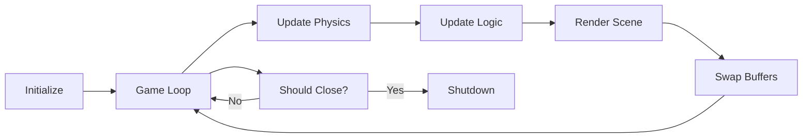

<div align="center">

# Kaya Game Engine

### A high-performance 3D game engine built from the ground up

[](LICENSE)
[](https://isocpp.org/)
[](https://www.opengl.org/)
[](https://cmake.org/)

**Modern C++17** | **OpenGL 4.6 Core** | **Jolt Physics** | **Cross-Platform**

[Features](#features) | [Getting Started](#getting-started) | [Documentation](#documentation) | [Examples](#examples)

---

</div>

## About

Kaya is a modern, from-scratch 3D game engine designed for learning and experimentation. Built with clean architecture and modern C++17, it provides a solid foundation for game development with integrated physics simulation, real-time rendering, and an intuitive API.

## Features

### Rendering System
- **Modern OpenGL 4.6** - Core profile with programmable pipeline
- **PBR Rendering** - Physically Based Rendering with metallic-roughness workflow
- **Dynamic Lighting** - Advanced lighting with Cook-Torrance BRDF
- **Shadow Mapping** - Real-time directional light shadows with PCF filtering
- **Post-Processing** - Bloom, tone mapping, and vignette effects
- **Skybox System** - Cubemap loading and environment mapping
- **Texture System** - PNG/JPG/TGA loading with filtering and wrapping modes
- **Model Loading** - Import OBJ, GLTF, and FBX models with Assimp
- **Flexible Camera** - First-person perspective camera with smooth controls
- **Shader System** - Easy-to-use shader compilation and uniform management
- **Primitive Rendering** - Optimized cube and sphere geometry with normals and UVs
- **Face Culling** - Back-face culling with correct CCW winding order
- **Frustum Culling** - CPU-side AABB/sphere frustum tests with configurable toggle
- **GPU Metrics Overlay** - Real-time FPS, draw calls, VRAM, culling stats (F3 toggle)
- **Debug Culling Visualization** - Wireframe AABBs and back-face highlight overlay (F4 toggle)

### Physics Engine
- **Jolt Physics Integration** - Industry-grade physics simulation
- **Rigid Body Dynamics** - Full support for dynamic and static bodies
- **Collision Detection** - Automatic broad-phase and narrow-phase collision
- **Shape Support** - Box and sphere collision shapes with more coming
- **Layer-Based Filtering** - Efficient collision layer management

### Core Systems
- **Application Framework** - Clean game loop with lifecycle hooks
- **Window Management** - Cross-platform windowing via GLFW
- **Input Handling** - Keyboard and mouse input with easy polling API
- **Event System** - Ready for extension with custom events
- **Math Library** - Full GLM integration for vector/matrix operations

### Developer Experience
- **CMake Build System** - Modern, cross-platform build configuration
- **Clean Architecture** - Well-organized, modular codebase
- **Header-Only Includes** - Simple single-header API (`#include <Kaya.h>`)
- **Example Projects** - Learn from working sandbox applications
- **One-Command Setup** - All dependencies bundled via git submodules

## Getting Started

### Prerequisites

- **CMake** 3.20 or higher ([Download](https://cmake.org/download/))
- **C++17 Compiler** (MSVC 2019+, GCC 9+, or Clang 10+)
- **Git** for cloning

### Quick Setup

**1. Clone the repository (with all dependencies)**
```bash
git clone --recursive https://github.com/AngeloAliCapuzzoHojaji/KayaGameEngine.git
cd KayaGameEngine
```

If you already cloned without `--recursive`, pull the dependencies:
```bash
git submodule update --init --recursive
```

**2. Generate GLAD** (one-time step)
- Visit https://glad.dav1d.de/
- **Language**: C/C++, **API gl**: Version 4.6, **Profile**: Core
- Click **GENERATE** and extract to `ThirdParty/glad/`

**3. Build the engine**
```bash
# Windows
cmake -B build -S .
cmake --build build --config Release

# Linux/macOS
cmake -B build -S . -DCMAKE_BUILD_TYPE=Release
cmake --build build
```

**4. Run an example**
```bash
# Windows
.\build\bin\Release\Sandbox.exe
.\build\bin\Release\RenderingDemo.exe
.\build\bin\Release\KayaEditor.exe

# Linux/macOS
./build/bin/Sandbox
```

> See [SETUP.md](SETUP.md) for platform-specific guidance and troubleshooting.

## Sandbox Demo

The included sandbox demonstrates core engine features:

### Controls
| Key | Action |
|-----|--------|
| `W` `A` `S` `D` | Move camera forward/left/back/right |
| `Space` | Move camera up |
| `Left Shift` | Move camera down |
| `Left Mouse` | Shoot a physics-enabled box |
| `F3` | Toggle GPU metrics overlay |
| `F4` | Toggle debug culling visualization |
| `ESC` | Close application |

### What's Included
- **Ground Plane** - Static collision surface
- **Dynamic Boxes** - Falling and stackable rigid bodies
- **Physics Spheres** - Rolling sphere simulation
- **Interactive Spawning** - Click to shoot objects
- **Free Camera** - Fly around the scene

## Examples

### Creating Your First Game

```cpp
#include <Kaya.h>

class MyGame : public Kaya::Application {
public:
    MyGame() : Application("My Awesome Game") {}

    void OnInit() override {
        // Initialize camera
        m_Camera = std::make_unique<Kaya::Camera>(45.0f, GetWindow().GetAspectRatio());
        m_Camera->SetPosition(glm::vec3(0, 2, 10));

        // Initialize physics
        m_Physics = std::make_unique<Kaya::PhysicsSystem>();
        m_Physics->Initialize();
        
        // Create a ground
        m_Ground = m_Physics->CreateBox(glm::vec3(0, -1, 0), glm::vec3(10, 1, 10), false);
        
        // Create a dynamic box
        m_Box = m_Physics->CreateBox(glm::vec3(0, 5, 0), glm::vec3(1, 1, 1), true);
    }

    void OnUpdate(float deltaTime) override {
        m_Physics->Update(deltaTime);
        
        // Handle input
        if (Kaya::Input::IsKeyPressed(Kaya::KeyCode::Space)) {
            m_Physics->AddForce(m_Box, glm::vec3(0, 100, 0));
        }
    }

    void OnRender() override {
        Kaya::Renderer::BeginScene(*m_Camera);
        
        // Render ground
        auto groundPos = m_Physics->GetBodyPosition(m_Ground);
        Kaya::Renderer::DrawCube(groundPos, glm::vec3(10, 1, 10), glm::vec4(0.3, 0.5, 0.3, 1));
        
        // Render box
        auto boxPos = m_Physics->GetBodyPosition(m_Box);
        Kaya::Renderer::DrawCube(boxPos, glm::vec3(1, 1, 1), glm::vec4(0.8, 0.3, 0.2, 1));
        
        Kaya::Renderer::EndScene();
    }

    void OnShutdown() override {
        m_Physics->Shutdown();
    }

private:
    std::unique_ptr<Kaya::Camera> m_Camera;
    std::unique_ptr<Kaya::PhysicsSystem> m_Physics;
    JPH::BodyID m_Ground, m_Box;
};

// Entry point
Kaya::Application* Kaya::CreateApplication() {
    return new MyGame();
}
```

### More Examples

Check out the [Examples](Examples/) directory for:
- Custom shaders and materials
- Advanced physics simulations
- Input handling patterns
- Scene management

## Architecture

### Engine Structure

```
KayaGameEngine/
├── Source/              # Engine source code
│   ├── Core/           # Application, window, entry point
│   ├── Rendering/      # Renderer, shaders, camera, culling, metrics
│   ├── Physics/        # Jolt Physics integration
│   ├── Input/          # Keyboard and mouse input
│   ├── Editor/         # Visual editor components
│   └── Kaya.h          # Single header include
├── Examples/            # Sample applications
│   ├── Sandbox.cpp      # Interactive physics demo
│   ├── RenderingDemo.cpp
│   ├── KayaEditor.cpp
│   └── FPSExample.cpp
├── ThirdParty/          # External dependencies (git submodules)
│   ├── glfw/            # Window management
│   ├── glad/            # OpenGL loader
│   ├── glm/             # Math library
│   ├── JoltPhysics/     # Physics engine
│   ├── imgui/           # GUI library
│   ├── ImGuizmo/        # Transform gizmos
│   ├── assimp/          # Model loading
│   └── stb/             # Image loading
└── CMakeLists.txt       # Build configuration
```

### Design Principles

- **Modular Design** - Clear separation of concerns
- **Clean API** - Intuitive and easy to use
- **Performance** - Face culling, frustum culling, optimized draw calls
- **Extensibility** - Easy to add new features
- **Cross-Platform** - Windows, Linux, macOS support

### Application Flow



## Roadmap

### Current Version (v1.0)
- [x] Core engine architecture
- [x] OpenGL 4.6 rendering
- [x] Jolt Physics integration
- [x] Basic primitives (cubes, spheres)
- [x] Camera system
- [x] Input handling

### Version 1.1 - Editor Release
- [x] Visual editor with ImGui
- [x] Entity system with component-based architecture
- [x] Scene hierarchy panel with selection
- [x] Properties inspector for transforms, rendering, and physics
- [x] Viewport window with framebuffer rendering
- [x] Transform gizmos (translate, rotate, scale)

### Version 1.2 - Rendering & Optimization
- [x] Texture system with loading and sampling
- [x] Model loading (GLTF, OBJ, FBX)
- [x] Shadow mapping with directional lights
- [x] PBR with metallic-roughness workflow
- [x] Face culling and frustum culling
- [x] GPU metrics overlay and debug visualization

### Planned Features

#### Rendering
- [x] Post-processing effects (bloom, tone mapping, color grading)
- [x] Particle systems
- [x] Skybox with HDR support
- [ ] Instanced rendering
- [x] Depth pre-pass optimization

#### Core Systems
- [ ] Asset management system
- [ ] Serialization and save/load
- [ ] Resource hot-reloading
- [ ] Profiler and debugging tools

#### Gameplay
- [ ] Audio system (OpenAL integration)
- [ ] Animation system
- [ ] UI/GUI framework
- [ ] Scripting support (Lua/Python)
- [ ] AI and pathfinding
- [ ] Networking for multiplayer

#### Tools
- [ ] Material editor
- [ ] Advanced scene editor features (copy/paste, prefabs)
- [ ] Asset pipeline tools

## Examples

Kaya includes several example projects to help you get started:

### RenderingDemo
Comprehensive showcase of all rendering features. Interactive demo with three scenes demonstrating textures, PBR materials, and shadow mapping.

Controls: WASD/Space/Shift for camera, Mouse to look, 1-4 to toggle features, ESC to exit.

Full guide: [Examples/RENDERING_DEMO.md](Examples/RENDERING_DEMO.md)

### Sandbox
Minimal example showing basic application setup, physics, and rendering.

### FPSExample
First-person camera example with physics integration.

### KayaEditor
Visual editor with scene hierarchy, properties panel, and 3D viewport.

## Using the Editor

### Running the Editor

```bash
# Windows
.\build\bin\Release\KayaEditor.exe

# Linux/macOS
./build/bin/KayaEditor
```

### Editor Features

- **Scene Hierarchy** - View and manage all entities in your scene
  - Right-click to create new entities (Cube, Sphere, Empty)
  - Click to select entities
  - Right-click on entities to delete
  
- **Properties Inspector** - Edit entity properties in real-time
  - Transform: Position, Rotation, Scale
  - Render: Geometry type, Color, Visibility
  - Physics: Body info, Dynamic/Static, Mass
  
- **Viewport** - Real-time 3D scene preview
  - WASD: Move camera
  - Space/Shift: Move camera up/down
  - Right Mouse + Drag: Rotate camera
  - Gizmo controls: Translate, Rotate, Scale
  - Ctrl: Snap to grid
  
- **Menu Bar**
  - File: New Scene, Open, Save, Exit
  - Edit: Undo/Redo (planned)
  - View: Toggle panels

## Documentation

### API Reference
- [Core Systems](docs/Core.md) - Application lifecycle and window management
- [Rendering](docs/Rendering.md) - Graphics pipeline and shaders
- [Physics](docs/Physics.md) - Jolt Physics integration guide
- [Input](docs/Input.md) - Input handling patterns

### Guides
- [Getting Started](SETUP.md) - Detailed setup instructions
- [Creating Your First Game](docs/FirstGame.md) - Step-by-step tutorial
- [Best Practices](docs/BestPractices.md) - Tips and patterns
- [Contributing](CONTRIBUTING.md) - How to contribute

## Contributing

Contributions are welcome! Whether it's bug reports, new features, documentation improvements, or suggestions.

### Development Setup
1. Fork the repository
2. Create a feature branch (`git checkout -b feature/amazing-feature`)
3. Commit your changes (`git commit -m 'Add amazing feature'`)
4. Push to the branch (`git push origin feature/amazing-feature`)
5. Open a Pull Request

## License

This project is released into the **public domain** under the [Unlicense](LICENSE).

You are free to use, modify, distribute, and use privately. No attribution required, but appreciated.

## Acknowledgments

Built with these excellent open-source libraries:

| Library | Purpose | License |
|---------|---------|---------|
| [GLFW](https://www.glfw.org/) | Window management and input | Zlib |
| [GLAD](https://glad.dav1d.de/) | OpenGL loader | MIT/Public Domain |
| [GLM](https://github.com/g-truc/glm) | Mathematics library | MIT |
| [Jolt Physics](https://github.com/jrouwe/JoltPhysics) | Physics engine | MIT |
| [Dear ImGui](https://github.com/ocornut/imgui) | GUI and editor interface | MIT |
| [ImGuizmo](https://github.com/CedricGuillemet/ImGuizmo) | Transform gizmos | MIT |
| [Assimp](https://github.com/assimp/assimp) | 3D model loading | BSD-3-Clause |
| [STB](https://github.com/nothings/stb) | Image loading | MIT/Public Domain |

---

<div align="center">

[Star this repo](https://github.com/AngeloAliCapuzzoHojaji/KayaGameEngine) | [Report Bug](https://github.com/AngeloAliCapuzzoHojaji/KayaGameEngine/issues) | [Request Feature](https://github.com/AngeloAliCapuzzoHojaji/KayaGameEngine/issues)

</div>
